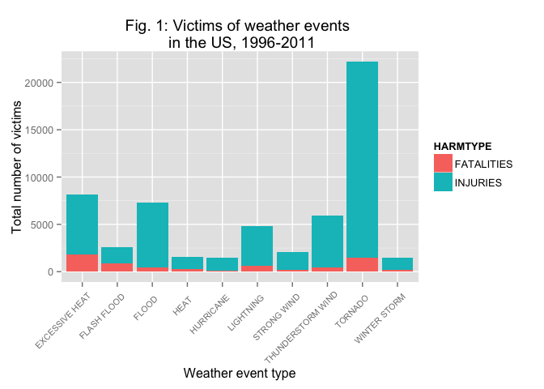
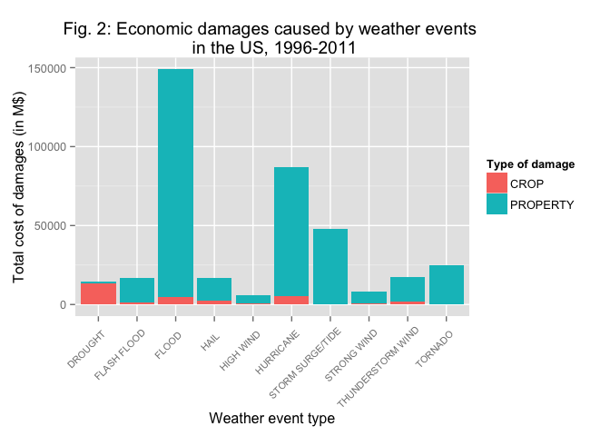
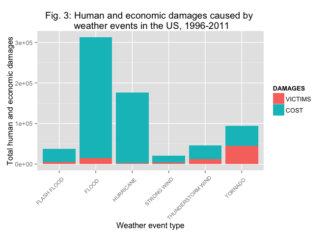

# The most impacting weather events across the US
Molina Rafidison  
23 Feb 2016  

## Preliminaries

### Synopsis

This project involves exploring the U.S. National Oceanic and Atmospheric Administration's (NOAA) storm database. This database tracks characteristics of major storms and weather events in the United States, including when and where they occur, as well as estimates of any fatalities, injuries, and property damage.  
  
The basic goal is to explore the NOAA Storm Database and answer the following questions about severe weather events:  
1. Across the United States, which types of events are most harmful with respect to population health?  
2. Across the United States, which types of events have the greatest economic consequences?
  
More information about the variables in the dataset are given by the:  
1. National Weather Service [Storm Data Documentation](https://d396qusza40orc.cloudfront.net/repdata%2Fpeer2_doc%2Fpd01016005curr.pdf)  
2. And National Climatic Data Center Storm Events [FAQ](https://d396qusza40orc.cloudfront.net/repdata%2Fpeer2_doc%2FNCDC%20Storm%20Events-FAQ%20Page.pdf)    

### Resources

This analysis is run in RStudio version 0.99.489. More information about the environment are shown below:


```r
sessionInfo()
```

```
## R version 3.2.3 (2015-12-10)
## Platform: x86_64-apple-darwin13.4.0 (64-bit)
## Running under: OS X 10.9.5 (Mavericks)
## 
## locale:
## [1] en_US.UTF-8/en_US.UTF-8/en_US.UTF-8/C/en_US.UTF-8/en_US.UTF-8
## 
## attached base packages:
## [1] stats     graphics  grDevices utils     datasets  methods   base     
## 
## loaded via a namespace (and not attached):
##  [1] magrittr_1.5    formatR_1.2.1   tools_3.2.3     htmltools_0.3  
##  [5] yaml_2.1.13     stringi_1.0-1   rmarkdown_0.9.2 knitr_1.12.3   
##  [9] stringr_1.0.0   digest_0.6.8    evaluate_0.8
```

## Data preprocessing 

### Packages and path

First of all, let us load any package we would need to run the full analysis.  
If the result is FALSE, the package(s) first need to be installed with the `install.packages()` function.


```r
packages <- c("dplyr", "ggplot2", "knitr", "R.utils", "reshape2")
sapply(packages, require, character.only = TRUE, quietly = TRUE)
```

```
##    dplyr  ggplot2    knitr  R.utils reshape2 
##     TRUE     TRUE     TRUE     TRUE     TRUE
```

And set the path.  
Make sure to be in the right working directory.


```r
path <- getwd()
```

### Getting and reading data

Download the Internet-based file from the URL source.  
Unzip the zip file containing the data if the csv files does not exist in the working directory.


```r
if (!file.exists("repdata-data-StormData.csv")) {
    fileUrl <- "https://d396qusza40orc.cloudfront.net/repdata%2Fdata%2FStormData.csv.bz2"
    tempFile <- "Dataset.zip"
    download.file(fileUrl, file.path(path, tempFile))
    ## Unzipping
    bunzip2(file.path(path, "repdata-data-StormData.csv.bz2"))
    ## Deleting temporary compressed file
    unlink(tempFile)
}
```

Load the data and assign it to the variable `NOAA`. This might take a few seconds.


```r
NOAA <- read.csv(file.path(path, "repdata-data-StormData.csv"))
```

Let us have a look at what the data look like.


```r
str(NOAA)
```

```
## 'data.frame':	902297 obs. of  37 variables:
##  $ STATE__   : num  1 1 1 1 1 1 1 1 1 1 ...
##  $ BGN_DATE  : Factor w/ 16335 levels "1/1/1966 0:00:00",..: 6523 6523 4242 11116 2224 2224 2260 383 3980 3980 ...
##  $ BGN_TIME  : Factor w/ 3608 levels "00:00:00 AM",..: 272 287 2705 1683 2584 3186 242 1683 3186 3186 ...
##  $ TIME_ZONE : Factor w/ 22 levels "ADT","AKS","AST",..: 7 7 7 7 7 7 7 7 7 7 ...
##  $ COUNTY    : num  97 3 57 89 43 77 9 123 125 57 ...
##  $ COUNTYNAME: Factor w/ 29601 levels "","5NM E OF MACKINAC BRIDGE TO PRESQUE ISLE LT MI",..: 13513 1873 4598 10592 4372 10094 1973 23873 24418 4598 ...
##  $ STATE     : Factor w/ 72 levels "AK","AL","AM",..: 2 2 2 2 2 2 2 2 2 2 ...
##  $ EVTYPE    : Factor w/ 985 levels "   HIGH SURF ADVISORY",..: 834 834 834 834 834 834 834 834 834 834 ...
##  $ BGN_RANGE : num  0 0 0 0 0 0 0 0 0 0 ...
##  $ BGN_AZI   : Factor w/ 35 levels "","  N"," NW",..: 1 1 1 1 1 1 1 1 1 1 ...
##  $ BGN_LOCATI: Factor w/ 54429 levels ""," Christiansburg",..: 1 1 1 1 1 1 1 1 1 1 ...
##  $ END_DATE  : Factor w/ 6663 levels "","1/1/1993 0:00:00",..: 1 1 1 1 1 1 1 1 1 1 ...
##  $ END_TIME  : Factor w/ 3647 levels ""," 0900CST",..: 1 1 1 1 1 1 1 1 1 1 ...
##  $ COUNTY_END: num  0 0 0 0 0 0 0 0 0 0 ...
##  $ COUNTYENDN: logi  NA NA NA NA NA NA ...
##  $ END_RANGE : num  0 0 0 0 0 0 0 0 0 0 ...
##  $ END_AZI   : Factor w/ 24 levels "","E","ENE","ESE",..: 1 1 1 1 1 1 1 1 1 1 ...
##  $ END_LOCATI: Factor w/ 34506 levels ""," CANTON"," TULIA",..: 1 1 1 1 1 1 1 1 1 1 ...
##  $ LENGTH    : num  14 2 0.1 0 0 1.5 1.5 0 3.3 2.3 ...
##  $ WIDTH     : num  100 150 123 100 150 177 33 33 100 100 ...
##  $ F         : int  3 2 2 2 2 2 2 1 3 3 ...
##  $ MAG       : num  0 0 0 0 0 0 0 0 0 0 ...
##  $ FATALITIES: num  0 0 0 0 0 0 0 0 1 0 ...
##  $ INJURIES  : num  15 0 2 2 2 6 1 0 14 0 ...
##  $ PROPDMG   : num  25 2.5 25 2.5 2.5 2.5 2.5 2.5 25 25 ...
##  $ PROPDMGEXP: Factor w/ 19 levels "","-","?","+",..: 17 17 17 17 17 17 17 17 17 17 ...
##  $ CROPDMG   : num  0 0 0 0 0 0 0 0 0 0 ...
##  $ CROPDMGEXP: Factor w/ 9 levels "","?","0","2",..: 1 1 1 1 1 1 1 1 1 1 ...
##  $ WFO       : Factor w/ 542 levels ""," CI","%SD",..: 1 1 1 1 1 1 1 1 1 1 ...
##  $ STATEOFFIC: Factor w/ 250 levels "","ALABAMA, Central",..: 1 1 1 1 1 1 1 1 1 1 ...
##  $ ZONENAMES : Factor w/ 25112 levels "","                                                                                                                               "| __truncated__,..: 1 1 1 1 1 1 1 1 1 1 ...
##  $ LATITUDE  : num  3040 3042 3340 3458 3412 ...
##  $ LONGITUDE : num  8812 8755 8742 8626 8642 ...
##  $ LATITUDE_E: num  3051 0 0 0 0 ...
##  $ LONGITUDE_: num  8806 0 0 0 0 ...
##  $ REMARKS   : Factor w/ 436781 levels "","\t","\t\t",..: 1 1 1 1 1 1 1 1 1 1 ...
##  $ REFNUM    : num  1 2 3 4 5 6 7 8 9 10 ...
```

### Cleaning data

The dataset will work on only need 8 variables from the original database. And let us convert `BGN_DATE` into date.


```r
cleanNOAA <- NOAA %>%
    select(BGN_DATE, EVTYPE, FATALITIES, INJURIES, CROPDMG, CROPDMGEXP, PROPDMG, PROPDMGEXP)

cleanNOAA$BGN_DATE <- as.Date(cleanNOAA$BGN_DATE, "%m/%d/%Y")
cleanNOAA$EVTYPE <- toupper(cleanNOAA$EVTYPE)
```

Browsing the official NOAA's website leads us to [this page](http://www.ncdc.noaa.gov/stormevents/details.jsp) giving more details about the storm event database. From 1950 to 1996, only 3 event types were recorded: tornado, thunderstorm wind and hail. Keeping these records will indeed bias our findings as they will unfairly add up potential fatalities and injuries to the 3 event types.  
Thus, the dataset will start from 1996 so that the `EVTYPE` variable is more relevant.


```r
cleanNOAA <- cleanNOAA %>% 
    filter(BGN_DATE >= "1996-01-01")
```

The storm data documentation identifies only **48 event types** although the factor variable contains 985 levels.
So let us write a function that replaces multiple expressions by their respective replacement.


```r
replaceVal <- function(data, var, pattern, replacement, use.regx = FALSE) {
    if (length(pattern) != length(replacement)) {
        stop("pattern and replacement vectors do not have the same length.")
    } else if (use.regx == TRUE) {
        for (i in 1:length(pattern))
            data[[var]] <- gsub(pattern[i], replacement[i], data[[var]])
    } else { 
        for (i in 1:length(pattern))
            data[[var]][data[[var]] == pattern[i]] <- replacement[i]
    } 
    return(data)
}
```

Create two vectors gathering the expressions to replace and their replacements.


```r
pattern <- c("A.+CAL LOW TIDE",
             ".* *A.+NCHE(S)* *.*",
             ".* *B.+ZZ.+D(S)* *.*",
             ".*C.+L *FLOOD.*",
             ".* *COLD(S)* *.*|.* *CHILL *.*",
             ".* *DRY.*|.* *DROUGHT *.*",
             ".* *(DUST)+ *(D.+V.+L)* *.*",
             "(DUST)+ *ST.+M(S)* *.*",
             ".* *DEBRIS.* *.*",
             " *D.+SE *FOG *",
             ".* *SMOKE(S)* *.*",
             "RECORD +HEAT(S)*|EX.+ +HEAT(S)*|RECORD +WARM.*(S)*|EX.+ +WARM.*(S)*",
             "RECORD +COLD(S)*|EX.+ +COLD(S)*",
             ".*FLASH( |/)+FLOOD.*",
             "^(URBAN.*|TIDAL)* FL.*D.*G*/* *",
             " *F.+G *FOG *",
             "(.*( .)*FROST.* *.*)|(.* *FREEZE *.*)|(FR.+G *.*)",
             "FUNNEL CLOUD(S)*",
             "HAIL(S)* *.*",
             "HEAT(S)* *.*",
             ".* *RAIN(S)* *.*",
             "(ACC.+TED|H.+Y)+ *SNOW(S)*.* *.*",
             ".* *SURF(S)* *.*",
             "^(H.+H)+ *WIND(S)*.*",
             " *T.+OON *.*| *HU.+NE *.*",
             "(ICE)+ *ST.+M(S)* *.*",
             ".* *(LAKE( |-)*EFFECT)+ *SNOW(S)* *.*",
             ".* *(LAK.+ORE)+ *FLOOD.*",
             ".* *LIGHT.*(S)* *.*",
             "MARINE +HAIL(S)*",
             "MARINE +HIGH *WIND(S)*",
             "MARINE +S.+G *WIND(S)*",
             "MARINE +T.+M *WIND(S)*",
             "RIP CURRENT(S)*",
             "SEICHE(S)*",
             "SLEET(S)*",
             "STORM *SURGE.*|AS.+CAL HIGH TIDE",
             "^(S.+G|GUSTY)+ WIND.* *.*|^( *W.*D.*)",
             "^(SEVERE|GUSTY)*( *T.*S.*T.*M(S)*)+( *(WIND.*)* .*)*",
             ".* *TORNADO.*(S)* *.*",
             "(TR.+AL)+ *D.+ION(S)* *.*",
             "(TR.+AL)+ *ST.+M(S)* *.*",
             ".* *TSUNAMI(S)* *.*",
             "(VO.+IC)+ *ASH.* *.*",
             " *WATERSPOUT(S)*",
             "WILD.* *FIRE(S)*.*",
             "(WINTER)+ *ST.+M(S)* *.*",
             "(WINT.+)+ *WEATHER(S)* *.*|(WINT.+)+ *MIX.*|^SNOW.* *.*"
             )

replacement <- c("ASTRONOMICAL LOW TIDE",
             "AVALANCHE",
             "BLIZZARD",
             "COASTAL FLOOD",
             "COLD/WIND CHILL",
             "DROUGHT",
             "DUST DEVIL",
             "DUST STORM",
             "DEBRIS FLOW",
             "DENSE FOG",
             "DENSE SMOKE",
             "EXCESSIVE HEAT",
             "EXTREME COLD/WIND CHILL",
             "FLASH FLOOD",
             "FLOOD",
             "FREEZING FOG",
             "FROST/FREEZE",
             "FUNNEL CLOUD",
             "HAIL",
             "HEAT",
             "HEAVY RAIN",
             "HEAVY SNOW",
             "HIGH SURF",
             "HIGH WIND",
             "HURRICANE",
             "ICE STORM",
             "LAKE-EFFECT SNOW",
             "LAKESHORE FLOOD",
             "LIGHTNING",
             "MARINE HAIL",
             "MARINE HIGH WIND",
             "MARINE STRONG WIND",
             "MARINE THUNDERSTORM WIND",
             "RIP CURRENT",
             "SEICHE",
             "SLEET",
             "STORM SURGE/TIDE",
             "STRONG WIND",
             "THUNDERSTORM WIND",
             "TORNADO",
             "TROPICAL DEPRESSION",
             "TROPICAL STORM",
             "TSUNAMI",
             "VOLCANIC ASH",
             "WATERSPOUT",
             "WILDFIRE",
             "WINTER STORM",
             "WINTER WEATHER"
             )

cleanNOAA <- replaceVal(cleanNOAA, "EVTYPE", pattern, replacement, use.regx = TRUE)

str(cleanNOAA)
```

```
## 'data.frame':	653530 obs. of  8 variables:
##  $ BGN_DATE  : Date, format: "1996-01-06" "1996-01-11" ...
##  $ EVTYPE    : chr  "WINTER STORM" "TORNADO" "THUNDERSTORM WIND" "THUNDERSTORM WIND" ...
##  $ FATALITIES: num  0 0 0 0 0 0 0 0 0 0 ...
##  $ INJURIES  : num  0 0 0 0 0 0 0 0 0 0 ...
##  $ CROPDMG   : num  38 0 0 0 0 0 0 0 0 0 ...
##  $ CROPDMGEXP: Factor w/ 9 levels "","?","0","2",..: 7 1 1 1 1 1 1 1 1 1 ...
##  $ PROPDMG   : num  380 100 3 5 2 0 400 12 8 12 ...
##  $ PROPDMGEXP: Factor w/ 19 levels "","-","?","+",..: 17 17 17 17 17 1 17 17 17 17 ...
```

Our dataset has 653,530 observations. Compute the percentage of the remaining values that are not in `replacement` to decide whether we keep them or not.


```r
outNOAA <- cleanNOAA %>%
    filter(!(EVTYPE %in% replacement)) %>%
    tally()

print(outNOAA)
```

```
##      n
## 1 2177
```

The value that we could not relate to an event type represents 2,177 observations or *0.33%* of the dataset we work on. We therefore decide that removing them from the dataset will not cause any bias.  
Here is an overview of the cleaned up dataset.


```r
cleanNOAA <- cleanNOAA %>%
    filter(EVTYPE %in% replacement)

head(cleanNOAA)
```

```
##     BGN_DATE            EVTYPE FATALITIES INJURIES CROPDMG CROPDMGEXP
## 1 1996-01-06      WINTER STORM          0        0      38          K
## 2 1996-01-11           TORNADO          0        0       0           
## 3 1996-01-11 THUNDERSTORM WIND          0        0       0           
## 4 1996-01-11 THUNDERSTORM WIND          0        0       0           
## 5 1996-01-11 THUNDERSTORM WIND          0        0       0           
## 6 1996-01-18              HAIL          0        0       0           
##   PROPDMG PROPDMGEXP
## 1     380          K
## 2     100          K
## 3       3          K
## 4       5          K
## 5       2          K
## 6       0
```


## Data processing

### Fatalities, injuries and even type

In this first part, focus on the most harmful weather events with respect to population health.  
To do so, subset from the database the data variables we need. `FATALITIES` and `INJURIES`are the variables related to the human damages.


```r
harmNOAA <- cleanNOAA %>% select(EVTYPE, FATALITIES, INJURIES)

head(harmNOAA)
```

```
##              EVTYPE FATALITIES INJURIES
## 1      WINTER STORM          0        0
## 2           TORNADO          0        0
## 3 THUNDERSTORM WIND          0        0
## 4 THUNDERSTORM WIND          0        0
## 5 THUNDERSTORM WIND          0        0
## 6              HAIL          0        0
```

Consider that the most harmful events with respect to the population gathers fatalities and injuries.  
So let us sum the data to identify where the records are higher for the `FATALITIES` and `INJURIES` variables in one variable called `HARM`.


```r
harmNOAA <- harmNOAA %>% mutate(VICTIMS = FATALITIES + INJURIES)
```

The summarizing dataset sums the number of harmful impacts in a descending order and grouped by type of event. Finally, only the number of harmful impacts greater than 0 are included.


```r
harmNOAA <- harmNOAA %>% 
    group_by(EVTYPE) %>%
    summarize(VICTIMS = sum(VICTIMS), 
              FATALITIES = sum(FATALITIES), 
              INJURIES = sum(INJURIES)) %>%
    arrange(desc(VICTIMS)) %>%
    filter(VICTIMS > 0)

head(harmNOAA, 20)
```

```
## Source: local data frame [20 x 4]
## 
##               EVTYPE VICTIMS FATALITIES INJURIES
##                (chr)   (dbl)      (dbl)    (dbl)
## 1            TORNADO   22178       1511    20667
## 2     EXCESSIVE HEAT    8190       1799     6391
## 3              FLOOD    7280        442     6838
## 4  THUNDERSTORM WIND    5903        436     5467
## 5          LIGHTNING    4795        652     4143
## 6        FLASH FLOOD    2561        887     1674
## 7        STRONG WIND    2072        221     1851
## 8               HEAT    1529        237     1292
## 9       WINTER STORM    1483        191     1292
## 10         HURRICANE    1453        125     1328
## 11         HIGH WIND    1318        235     1083
## 12       RIP CURRENT    1045        542      503
## 13        HEAVY SNOW     807        107      700
## 14              HAIL     720          7      713
## 15    WINTER WEATHER     675         68      607
## 16   COLD/WIND CHILL     521        389      132
## 17          BLIZZARD     455         70      385
## 18        DUST DEVIL     428         13      415
## 19         ICE STORM     400         82      318
## 20         HIGH SURF     385        145      240
```


### Crop & property damages and event types

In this second part, focus on greatest economic consequences across the US.  
To do so, subset from the database the data variables we need. `CROPDMG`, `CROPDMGEXP`, `PROPDMG` and `PROPDMGEXP` are the variables related to the crop and property (monetary) damages. Also convert `CROPDMEXP` and `PROPDMGEXP` into characters as they contain letters.


```r
ecoNOAA <- cleanNOAA %>% select(EVTYPE, CROPDMG, CROPDMGEXP, PROPDMG, PROPDMGEXP)

ecoNOAA$CROPDMGEXP <- as.character(ecoNOAA$CROPDMGEXP)
ecoNOAA$PROPDMGEXP <- as.character(ecoNOAA$PROPDMGEXP)

str(ecoNOAA)
```

```
## 'data.frame':	651353 obs. of  5 variables:
##  $ EVTYPE    : chr  "WINTER STORM" "TORNADO" "THUNDERSTORM WIND" "THUNDERSTORM WIND" ...
##  $ CROPDMG   : num  38 0 0 0 0 0 0 0 0 0 ...
##  $ CROPDMGEXP: chr  "K" "" "" "" ...
##  $ PROPDMG   : num  380 100 3 5 2 0 400 12 8 12 ...
##  $ PROPDMGEXP: chr  "K" "K" "K" "K" ...
```

Have a look at the values of the two variables `CROPDMGEXP` and `PROPDMGEXP`.


```r
unique(ecoNOAA$CROPDMGEXP)
```

```
## [1] "K" ""  "M" "B"
```

```r
unique(ecoNOAA$PROPDMGEXP)
```

```
## [1] "K" ""  "M" "B" "0"
```

As described in the Storm Data Documentation, "Alphabetical characters used to signify magnitude include “K” for thousands, “M” for millions, and “B” for billions". Consider that the value "0" and missing value "" stand for simple units. This rule is applied on both variables: `CROPDMGEXP` and `PROPDMGEXP`.  
Fortunately, we already created a function earlier we will re-use that replaces multiple expressions.


```r
ecoNOAA <- replaceVal(ecoNOAA, 
                      "CROPDMGEXP", 
                      c("", "K", "M", "B"), 
                      c(1, 1000, 1000000, 1000000000))
ecoNOAA <- replaceVal(ecoNOAA, 
                      "PROPDMGEXP", 
                      c("", "0", "K", "M", "B"), 
                      c(1, 1, 1000, 1000000, 1000000000))
```

The summarizing datasets sums the number of crop and property monetary damages (in M$) in a descending order and grouped by type of event. Finally, only the number of damages greater than 0 are included.  


```r
ecoNOAA <- ecoNOAA %>%
    mutate(CDMG = (CROPDMG * as.numeric(CROPDMGEXP))/1e+06) %>%
    mutate(PDMG = (PROPDMG * as.numeric(PROPDMGEXP))/1e+06) %>%
    group_by(EVTYPE) %>%
    summarize(CDMG = sum(CDMG), 
              PDMG = sum(PDMG), 
              DMG = CDMG + PDMG) %>%
    arrange(desc(DMG)) %>%
    filter(DMG > 0)

head(ecoNOAA, 10)
```

```
## Source: local data frame [10 x 4]
## 
##               EVTYPE       CDMG       PDMG       DMG
##                (chr)      (dbl)      (dbl)     (dbl)
## 1              FLOOD  4983.2665 144003.156 148986.42
## 2          HURRICANE  5350.1078  81718.889  87069.00
## 3   STORM SURGE/TIDE     0.8550  47844.149  47845.00
## 4            TORNADO   283.4250  24616.946  24900.37
## 5  THUNDERSTORM WIND  1694.6536  15555.951  17250.61
## 6               HAIL  2476.0294  14595.143  17071.17
## 7        FLASH FLOOD  1334.9017  15222.269  16557.17
## 8            DROUGHT 13367.5810   1047.834  14415.41
## 9        STRONG WIND   467.7186   7942.411   8410.13
## 10         HIGH WIND   633.5613   5248.378   5881.94
```


## Results

### Most harmful weather events

Reminder:  
1. Across the United States, which types of events are most harmful with respect to population health?  
In order to answer the question, we will only take the ten first rows of the summarizing dataset we worked on earlier.  
Melt the subset to have a tiny one that identifies the harm type - fatalities or injuries. Here is the top 10 of most harmful weather events across the US from 1996 to 2011.


```r
topHarmNOAA <- melt(harmNOAA[1:10, ], 
                    id.vars = "EVTYPE",
                    measure.vars = c("FATALITIES", "INJURIES"),
                    variable.name = "HARMTYPE", 
                    value.name = "VICTIMS")

print(topHarmNOAA)
```

```
##               EVTYPE   HARMTYPE VICTIMS
## 1            TORNADO FATALITIES    1511
## 2     EXCESSIVE HEAT FATALITIES    1799
## 3              FLOOD FATALITIES     442
## 4  THUNDERSTORM WIND FATALITIES     436
## 5          LIGHTNING FATALITIES     652
## 6        FLASH FLOOD FATALITIES     887
## 7        STRONG WIND FATALITIES     221
## 8               HEAT FATALITIES     237
## 9       WINTER STORM FATALITIES     191
## 10         HURRICANE FATALITIES     125
## 11           TORNADO   INJURIES   20667
## 12    EXCESSIVE HEAT   INJURIES    6391
## 13             FLOOD   INJURIES    6838
## 14 THUNDERSTORM WIND   INJURIES    5467
## 15         LIGHTNING   INJURIES    4143
## 16       FLASH FLOOD   INJURIES    1674
## 17       STRONG WIND   INJURIES    1851
## 18              HEAT   INJURIES    1292
## 19      WINTER STORM   INJURIES    1292
## 20         HURRICANE   INJURIES    1328
```

The new dataset allows us to create a bar plot gathering both types, fatalities and injuries. 


```r
ggplot(topHarmNOAA, aes(EVTYPE, fill = HARMTYPE)) + 
    geom_bar(aes(y = VICTIMS), stat = "identity") +
    theme(axis.text.x = element_text(size = 8, angle = 45, vjust = .9, hjust = .9)) +
    labs(x = "Weather event type",
         y = "Total number of victims",
         title = "Fig. 1: Victims of weather events \n in the US, 1996-2011") +
    theme(plot.title = element_text(hjust = 0.5))
```



As Fig. 1 shows, EXCESSIVE HEAT was the most harmful weather event regarding fatalities. 


```r
harmNOAA$EVTYPE[which.max(harmNOAA$FATALITIES)]
```

```
## [1] "EXCESSIVE HEAT"
```

However, Fig. 1 also shows that TORNADO was the most harmful weather event in terms of injuries and in general too. 


```r
harmNOAA$EVTYPE[which.max(harmNOAA$INJURIES)]
```

```
## [1] "TORNADO"
```

```r
harmNOAA$EVTYPE[which.max(harmNOAA$VICTIMS)]
```

```
## [1] "TORNADO"
```


### Greatest economic consequences

Reminder:  
2. Across the United States, which types of events have the greatest economic consequences?  
  
In order to answer the question, we will only take the ten first rows of the summarizing dataset we worked in the second part of Data processing.  
Melt the subset to have a tiny one that identifies the damage type - crop or property damages. Here is the top 10 of greatest economic consequences (in M$) caused by weather events across the US from 1996 to 2011.


```r
topEcoNOAA <- melt(ecoNOAA[1:10, ], 
                   id.vars = "EVTYPE",
                   measure.vars = c("CDMG", "PDMG"),
                   variable.name = "DMGTYPE", 
                   value.name = "COST")

print(topEcoNOAA)
```

```
##               EVTYPE DMGTYPE        COST
## 1              FLOOD    CDMG   4983.2665
## 2          HURRICANE    CDMG   5350.1078
## 3   STORM SURGE/TIDE    CDMG      0.8550
## 4            TORNADO    CDMG    283.4250
## 5  THUNDERSTORM WIND    CDMG   1694.6536
## 6               HAIL    CDMG   2476.0294
## 7        FLASH FLOOD    CDMG   1334.9017
## 8            DROUGHT    CDMG  13367.5810
## 9        STRONG WIND    CDMG    467.7186
## 10         HIGH WIND    CDMG    633.5613
## 11             FLOOD    PDMG 144003.1562
## 12         HURRICANE    PDMG  81718.8890
## 13  STORM SURGE/TIDE    PDMG  47844.1490
## 14           TORNADO    PDMG  24616.9457
## 15 THUNDERSTORM WIND    PDMG  15555.9514
## 16              HAIL    PDMG  14595.1434
## 17       FLASH FLOOD    PDMG  15222.2689
## 18           DROUGHT    PDMG   1047.8336
## 19       STRONG WIND    PDMG   7942.4112
## 20         HIGH WIND    PDMG   5248.3784
```

The new dataset allows us to create a bar plot gathering both types, fatalities and injuries. 


```r
ggplot(topEcoNOAA, aes(EVTYPE, fill = DMGTYPE)) + 
    geom_bar(aes(y = COST), stat = "identity") +
    theme(axis.text.x = element_text(size = 8, angle = 45, vjust = .9, hjust = .9)) +
    scale_fill_discrete(name = "Type of damage",
                        labels = c("CROP", "PROPERTY")) +
    labs(x = "Weather event type",
         y = "Total cost of damages (in M$)",
         title = "Fig. 2: Economic damages caused by weather events \n in the US, 1996-2011") +
    theme(plot.title = element_text(hjust = 0.5))
```



As Fig. 2 shows, DROUGHT had the greatest economic consequences with regards of crop damages. 


```r
ecoNOAA$EVTYPE[which.max(ecoNOAA$CDMG)]
```

```
## [1] "DROUGHT"
```

However, Fig. 2 also shows that FLOOD was the weather event with greatest economic consequences in terms of property damages. It has so much consequences that FLOOD is also the most severe event in general. 


```r
ecoNOAA$EVTYPE[which.max(ecoNOAA$PDMG)]
```

```
## [1] "FLOOD"
```

```r
ecoNOAA$EVTYPE[which.max(ecoNOAA$DMG)]
```

```
## [1] "FLOOD"
```

## Conclusion

This analysis meant to explore the storm database provided by the US National Oceanic and Atmospheric Administration's (NOAA).

The final results are an estimate although they clearly present the most harmful weather events across the US from 1996 to 2011 both from human and economic standpoints. That would be interesting to have a deeper look at where and when they occur.   

We found out that EXCESSIVE HEAT and TORNADOES are the weather events that made more victims respectively in terms of fatalities and injuries. TORNADOES remain the most severe weather event.  
On the other hand, the weather events DROUGHT and FLOOD had the greatest economic consequences respectively in terms of crop and property damages. FLOOD remain the most severe weather event.
The weather events are different according to the kind of damages, either human or monetary.  

In closing, merge the top datasets used to create the plots above. Remove the NAs introduces by coercion. We want to see if there is any correlation between the economic consequences and the number of victims in the top harmful weather events.


```r
harmEcoNOAA <- full_join(topHarmNOAA, topEcoNOAA)
```

```
## Joining by: "EVTYPE"
```

```r
harmEcoNOAA <- harmEcoNOAA %>%
    filter(!is.na(COST)) %>%
    filter(!is.na(VICTIMS)) %>%
    group_by(EVTYPE) %>%
    summarize(VICTIMS = sum(VICTIMS), COST = sum(COST))

print(harmEcoNOAA)
```

```
## Source: local data frame [6 x 3]
## 
##              EVTYPE VICTIMS      COST
##               (chr)   (dbl)     (dbl)
## 1       FLASH FLOOD    5122  33114.34
## 2             FLOOD   14560 297972.85
## 3         HURRICANE    2906 174137.99
## 4       STRONG WIND    4144  16820.26
## 5 THUNDERSTORM WIND   11806  34501.21
## 6           TORNADO   44356  49800.74
```

There are only 6 types of weather event in common. So let us melt the dataset in order to plot it.


```r
harmEcoNOAA <- melt(harmEcoNOAA, 
                    id.vars = "EVTYPE", 
                    variable.name = "DAMAGES", 
                    value.name = "VALUE")
```

And see if there is a similar behavior between both type of damages regardless of y-axis units.


```r
ggplot(harmEcoNOAA, aes(x = EVTYPE, y = VALUE, fill = DAMAGES)) + 
    geom_bar(stat = "identity") +
    theme(axis.text.x = element_text(size = 8, angle = 45, vjust = .9, hjust = .9)) +
    labs(x = "Weather event type",
         y = "Total human and economic damages",
         title = "Fig. 3: Human and economic damages caused by \n weather events in the US, 1996-2011") +
    theme(plot.title = element_text(hjust = 0.5))
```



The worst weather events from an economic point of view are definitely not the ones that make more victims. 
